### 📚 Chat Installation documentation

### **Installation SoftwareAI**  
```bash
pip install --upgrade SoftwareAI
```
### **Editor**  
```python
from softwareai.Editor import initeditor
initeditor()
```
### **Configuring Keys openai** 
- **1 - Click on the key icon in the menu**  

- **2 - Enter the key name and there is openai key**  
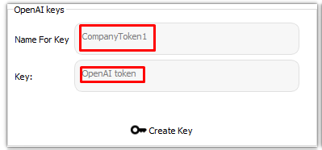
- **3 - Click Create Key**  
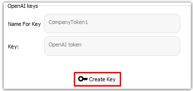
### **Configuring Keys Firebase**
- **1 - Add any name to your Firebase app**  
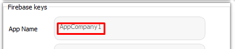
- **1 - Add realtime database url**  
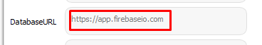
- **1.1 - you can find its url by accessing the databaserealtime section**  
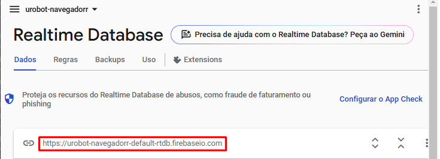
- **2 - Add realtime storage url**  
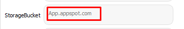
- **2.1 - you can find its url by accessing the storage section**  
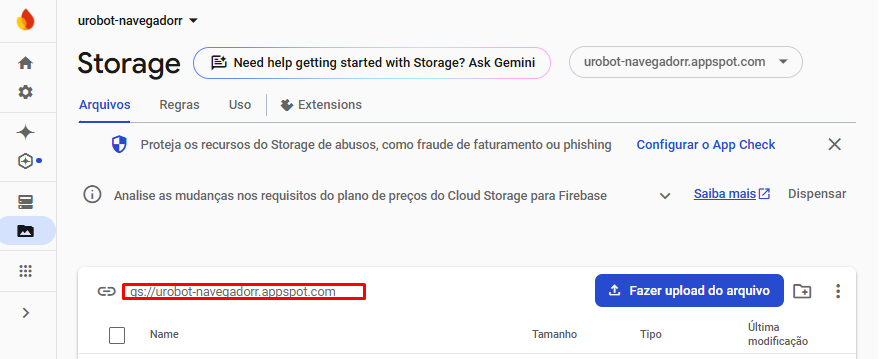
- **3 - Add your downloaded firebase credentials**  

- **3.1 - Navigate to where the credentials are and click open**  
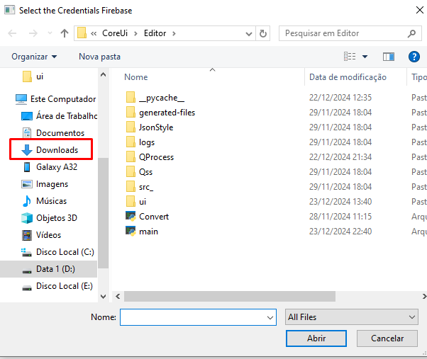
- **3.2 - Click to Create key**  
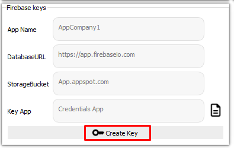
- **3.3 - Step by step to find generate firebase keys**  

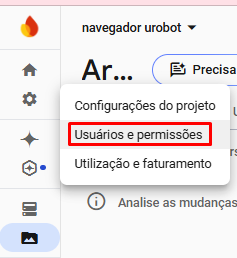
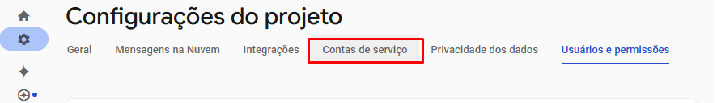
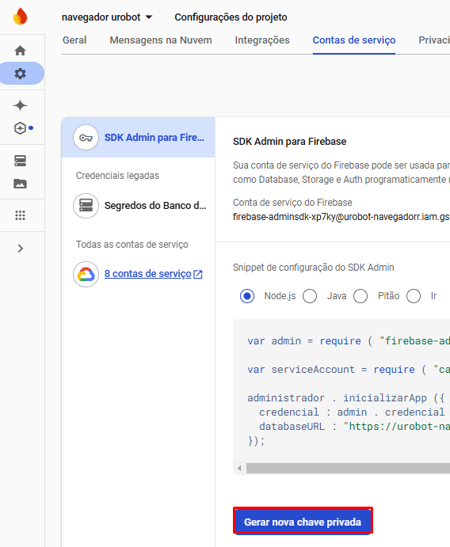
- **After completing all the steps to add openai keys and firebase keys**  
- **You are ready to start the chat**  
 
### Start chat using a small script
```python
from softwareai.Chat import initchat
initchat()
```
