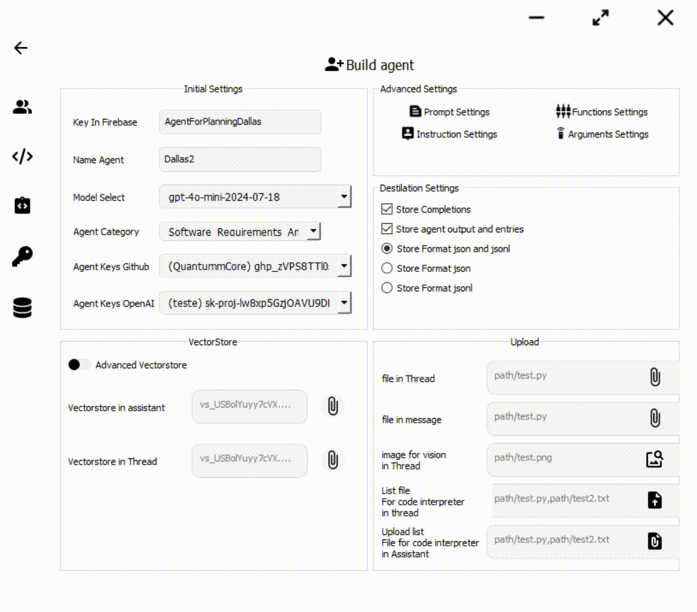

# 👥 Your software company governed by AI


# 📜 Table of Contents
- [📖 About](Docs/About/SoftwareAI.md)
- [📖 Index Docs](#-indexdocs)
- [🔄 Info-Update](Docs/Update/Update.md)
- [🚀 Starting SoftwareAI Chat](#-start-softwareai-chat)
- [🚀 Starting SoftwareAI Editor](#-softwareai-editor)
- [🚀 Starting Without Ui](#-get-started-softwareai-without-ui)
- [👥 Index-Team](Docs/IndexTeam/IndexTeam.md)
- [🗺️ Roadmaps](Docs/Roadmaps)
- [📊 Flowchart](Docs/Flowchart/Fluxogram-beta-v-0.1.8.pdf)
- [📁 SoftwareAI Structure](Docs/Structure/SoftwareAIStructure.md)
- [🤝 Contributing](#-contributing)
#

⚠️ **Note**: SoftwareAI is in beta phase and does not currently reflect the final product.
## 🚀 SoftwareAI-Editor 
**🎨 Build Agents**: Edit, Build and Bring your Agent to life

## 📚 [Editor About](Docs/About/Editor.md)
## 📚 [Editor RoadMap](Docs/Roadmaps/Editor-Roadmap.md)
### 📖 Editor Installation
```python
pip install --upgrade SoftwareAI
```
### 🐍 Editor Usage
```python
from softwareai.Editor import initeditor
initeditor()
```
## 🚀 Start SoftwareAI-Chat

## 📚 [Chat About](Docs/About/Chat.md)
## 📚 [Chat RoadMap](Docs/Roadmaps/Chat-Roadmap.md)
## 📚 [Chat Installation](Docs/Installation/Chat.md)
### 🐍 Chat Usage
```python
from softwareai.Chat import initchat
initchat()
```
#
## 🚀 Get started SoftwareAI without UI
- 🛠️ SoftwareAI Installation:
```python
pip install --upgrade SoftwareAI
```
- 🐍 Usage:
```python
# Importing SoftwareAI Agents
from softwareai.CoreApp._init_agents_ import AgentInitializer

# Importing SoftwareAI Libraries
from softwareai.CoreApp._init_libs_ import *

# Initializing Agent
byte_manager = AgentInitializer.get_agent('ByteManager') 

# Usage Example
message = "I request a script for technical analysis of Solana cryptocurrency"
owner_response = byte_manager.AI_1_ByteManager_Company_Owners(message)
print(owner_response)
```
## 💡 SoftwareAI without UI Features
- 📊 Creation of pre-project documentation
- 🗺️ Roadmap generation
- 📅 Automatic schedules
- 📝 Requirements analysis
- 🔄 GitHub repository management
- ⚡ Loop of 5 automatic improvements
- 📚 Repository on github generated with the example above: https://github.com/A-I-O-R-G/solana-analyzer


## 📖 IndexDocs
- [About](Docs/About)
- [Core](Docs/Core)
- [Destilation](Docs/Destilation/DestilationAgents.md)
- [IndexTeam](Docs/IndexTeam/IndexTeam.md)
- [Installation](Docs/Installation)
- [Moderation](Docs/Moderation/RemoveWords.md)
- [Roadmaps](Docs/Roadmaps)
- [Structure](Docs/Structure/SoftwareAIStructure.md)
- [ToolsAndFunctions](Docs/ToolsAndFunctions/doc-tools.md)
- [Update](Docs/Update/Update.md)
## 🤝 Contributing
While SoftwareAI is primarily AI-driven, we welcome contributions from the community:
- 🐛 Bug Reports
- 💡 Feature Suggestions
- 📝 Documentation Improvements
- 🔧 Code Contributions


