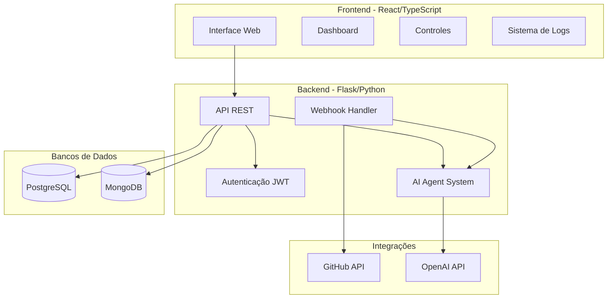

# SoftwareAI

**SoftwareAI: Uma Empresa de Desenvolvimento de Software Governada por IA.**
 
*Este repositório contém nosso primeiro protótipo de equipe funcional: **PR-AI**, a plataforma que automatiza a documentação de Pull Requests.*

> **🚀 Comece a Usar Agora!**
>
> A maneira mais fácil e rápida de experimentar o poder do SoftwareAI é através da nossa plataforma oficial.
>
> **Visite [www.softwareai.site](https://www.softwareai.site) para iniciar gratuitamente!**

[Plataforma Oficial](https://www.softwareai.site) • [Documentação](https://www.softwareai.site/docs/api) • [Instalação Local (em breve)]() • [Arquitetura](#️-arquitetura-do-sistema-pr-ai)

-----

## ✨ Visão Geral

**SoftwareAI** é um projeto ambicioso para construir uma organização de desenvolvimento de software totalmente autônoma e gerenciada por agentes de Inteligência Artificial. A visão é criar "equipes" de IA especializadas para cada função essencial: desenvolvimento, QA, DevOps, design, gerenciamento de projetos e muito mais.

Este repositório abriga o **PR-AI**, nosso primeiro protótipo e a prova de conceito fundamental. O PR-AI atua como a primeira "equipe" autônoma, focada em resolver uma tarefa crítica de DevOps: a documentação de Pull Requests. Ele utiliza modelos de IA de última geração para analisar *diffs* de código, gerar descrições estruturadas e manter um histórico completo, operando como um membro eficiente e padronizado da equipe de engenharia.

### 🎯 Problema Resolvido (pelo Módulo PR-AI)

  - **Economia de Tempo**: Reduz em até 90% o tempo gasto escrevendo descrições de PRs.
  - **Padronização**: Garante consistência na documentação em toda a organização.
  - **Rastreabilidade**: Mantém logs completos de todas as operações para auditoria e monitoramento.
  - **Escalabilidade**: Processa PRs de qualquer tamanho através de um sistema de *chunking* inteligente.

-----

## 🤖 PR-AI: A Primeira Equipe Funcional

A seguir, estão os detalhes técnicos do módulo PR-AI, o componente atualmente implementado do ecossistema SoftwareAI.

### 🏗️ Arquitetura do Sistema PR-AI

### 🚀 Funcionalidades Principais do PR-AI

#### 📊 Dashboard em Tempo Real

  - **Métricas ao Vivo**: Taxa de sucesso, PRs processados, uptime do sistema.
  - **Atividade Recente**: Stream de eventos em tempo real.
  - **Health Monitoring**: Status de todas as integrações.

#### 🤖 Processamento Inteligente de PRs

  - **Análise Automática**: Processamento via webhook do GitHub.
  - **Chunking Inteligente**: Suporte para PRs de qualquer tamanho.
  - **Multi-Model Support**: GPT-5-nano otimizado para custo-benefício.

#### 📝 Sistema de Logs Avançado

  - **Níveis Granulares**: INFO, WARNING, ERROR, SUCCESS.
  - **Busca em Tempo Real**: Filtros por nível, termo e período.
  - **Exportação**: Download de logs em formato TXT.

#### ⚙️ Controles DevOps

  - **Reprocessamento Manual**: Reprocessar PRs específicos.
  - **Deploy Forçado**: Sistema de deploy com confirmação.
  - **Webhook Customizado**: Envio de payloads personalizados.
  - **Rate Limit Monitoring**: Acompanhamento de limites de API.

#### 🔒 Segurança e Autenticação

  - **JWT Authentication**: Sistema robusto de autenticação.
  - **Mascaramento de Tokens**: Proteção de credenciais sensíveis.
  - **Audit Trail**: Rastreamento completo de todas as ações.

-----

## 💻 Stack Tecnológica (Módulo PR-AI)

### Backend

  - **Framework**: Flask 3.0+ com suporte ASGI
  - **AI Integration**: OpenAI GPT-5-nano via Agents Framework
  - **Databases**:
      - PostgreSQL (dados estruturados)
      - MongoDB (logs e métricas)
  - **Authentication**: JWT com Flask-JWT-Extended
  - **Async Processing**: Threading para operações longas

### Frontend

  - **Framework**: React 18 com TypeScript
  - **UI Components**: shadcn/ui (design system moderno)
  - **Styling**: Tailwind CSS
  - **Icons**: Lucide React
  - **State Management**: React Hooks

## 📦 Instalação do Protótipo PR-AI

### Pré-requisitos

  - Python 3.9+
  - Node.js 18+
  - PostgreSQL 15+
  - MongoDB 6.0+
  - Git

### 🔧 Configuração

**Em Breve.**

As instruções detalhadas de configuração para a auto-hospedagem, incluindo a criação de chaves de API e configuração de ambiente, serão disponibilizadas em breve. Por enquanto, toda a nossa engenharia está focada em oferecer a melhor experiência através da plataforma **[www.softwareai.site](https://www.google.com/search?q=https://www.softwareai.site)**.

## 📈 Roadmap do SoftwareAI

Nosso roadmap reflete a jornada da construção de uma equipe única para uma organização completa.

### 🎯 Curto Prazo (Melhorias na Equipe PR-AI)

  - [ ] CI/CD da pipeline (.yml) disponibilizado para download.
  - [ ] Suporte para GitLab e Bitbucket.
  - [ ] Integração com Slack, Discord, Telegram e WhatsApp para notificações.
  - [ ] Analytics Dashboard avançado sobre a qualidade das documentações.
  - [ ] Suporte a múltiplos idiomas nas descrições geradas.

### 🚀 Longo Prazo (Construindo Novas Equipes de IA)

  - [ ] **Equipe de QA**: Agentes de IA para análise estática de código, geração de testes unitários e testes de integração.
  - [ ] **Equipe de Gerenciamento de Projetos**: IA para criar e gerenciar cronogramas, planilhas de tarefas (sprints) e alocar recursos.
  - [ ] **Equipe de Desenvolvimento**: Agentes capazes de escrever código funcional a partir de especificações de alto nível.
  - [ ] **Equipe de UI/UX**: Modelos de IA para gerar wireframes, protótipos e até componentes de design system.
  - [ ] **Orquestrador Central**: Um sistema de gerenciamento que coordena todas as equipes de IA para entregar um produto de software de ponta a ponta.

## 🤝 Contribuindo

Contribuições são a base para transformar o SoftwareAI em realidade! Por favor, leia [CONTRIBUTING.md](https://www.google.com/search?q=CONTRIBUTING.md) para detalhes sobre nosso código de conduta e o processo de submissão de pull requests.

## 📄 Licença

Este projeto está licenciado sob a MIT License - veja [LICENSE](https://www.google.com/search?q=LICENSE) para detalhes.

## 👥 Time

Desenvolvido com ❤️ por desenvolvedores, para um futuro governado por IA.

-----

**[⬆ Voltar ao topo](https://www.google.com/search?q=%23softwareai)**

